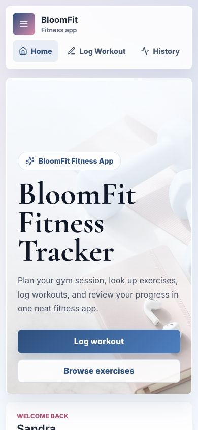

# BloomFit Fitness Tracker

BloomFit is a polished React fitness tracking app for logging workouts, browsing gym exercises, reviewing workout history, and visualizing progress over time. It is designed as a portfolio-ready frontend project with clear navigation, a soft modern visual style, and responsive layouts for desktop, tablet, and mobile screens.

## Live Demo

[Open the app on GitHub Pages](https://sandra-os.github.io/fitness-tracker-app/)

> The GitHub Pages deployment may take a minute to appear after a new push.

## Features

- Log workouts with name, type, date, cardio minutes, and notes
- Add multiple exercises per workout
- Track sets, reps, and weight used for each exercise
- Save workout history in `localStorage`
- Navigate between Home, Log Workout, History, Exercises, Progress, and Profile views
- Browse an exercise library with movement cues, muscle filters, and equipment details
- Link out to larger exercise directories for deeper movement research
- Search workout history by workout, exercise, category, or note
- Filter history by workout type and date range
- View weekly workout, cardio, active day, and strength-volume summaries
- Review all-time dashboard stats and personal best highlights
- Track progress with weekly volume, cardio, and exercise charts
- Save a local demo profile with name, email, and training goal
- Installable PWA metadata and service worker support
- Reset to curated demo data for quick portfolio review
- Fully responsive layout for phones, tablets, laptops, and large displays
- Reusable React components and utility functions

## App vs Website

BloomFit is published as a web app on GitHub Pages. It also includes PWA support, which means users can install it from supported browsers and launch it like an app.

This version does not include secure real email authentication because GitHub Pages is static hosting. The Profile page includes a local demo profile only. Real sign-in should be added with a backend/auth provider such as Supabase, Firebase, Auth0, or a custom API.

## Tech Stack

- React
- Vite
- JavaScript
- CSS3
- Recharts
- Lucide React
- Vitest
- Testing Library
- Web App Manifest
- Service Worker
- GitHub Pages

## Screenshots




## Folder Structure

```text
fitness-tracker-app/
  public/
    bloomfit-hero.jpg
    bloomfit-icon.svg
    manifest.webmanifest
    sw.js
  docs/
    screenshots/
      dashboard.jpg
      mobile.jpg
  src/
    components/
      AppNav.jsx
      DashboardCard.jsx
      EmptyState.jsx
      ExerciseLibrary.jsx
      FilterBar.jsx
      ProfilePanel.jsx
      ProgressCharts.jsx
      StatCard.jsx
      WeeklySummary.jsx
      WorkoutForm.jsx
      WorkoutHistory.jsx
    hooks/
      useLocalStorage.js
    lib/
      exerciseLibrary.js
      exerciseLibrary.test.js
      workoutUtils.js
      workoutUtils.test.js
    App.jsx
    App.css
    main.jsx
    setupTests.js
  .github/
    workflows/
      deploy.yml
  README.md
  package.json
  vite.config.js
```

## Getting Started

Clone the repository:

```bash
git clone https://github.com/Sandra-os/fitness-tracker-app.git
cd fitness-tracker-app
```

Install dependencies:

```bash
npm install
```

Start the development server:

```bash
npm run dev
```

Run tests:

```bash
npm test
```

Create a production build:

```bash
npm run build
```

Preview the production build locally:

```bash
npm run preview
```

## Deployment

This project includes a GitHub Actions workflow that builds the Vite app and deploys it to GitHub Pages whenever changes are pushed to the `main` branch.

If the live link is not active yet, open the repository settings in GitHub, go to **Pages**, and make sure the source is set to **GitHub Actions**.

## Future Improvements

- Add editable workout entries
- Add real email/password or magic-link authentication
- Add cloud database sync per signed-in user
- Add custom exercise categories and saved templates
- Add body measurements and goal tracking
- Add CSV export for workout history
- Add dark mode
